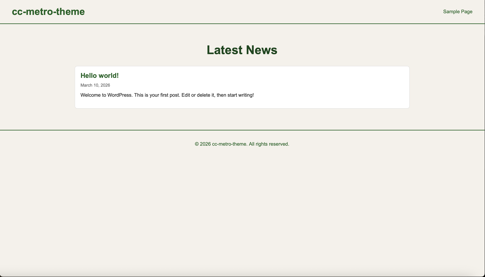
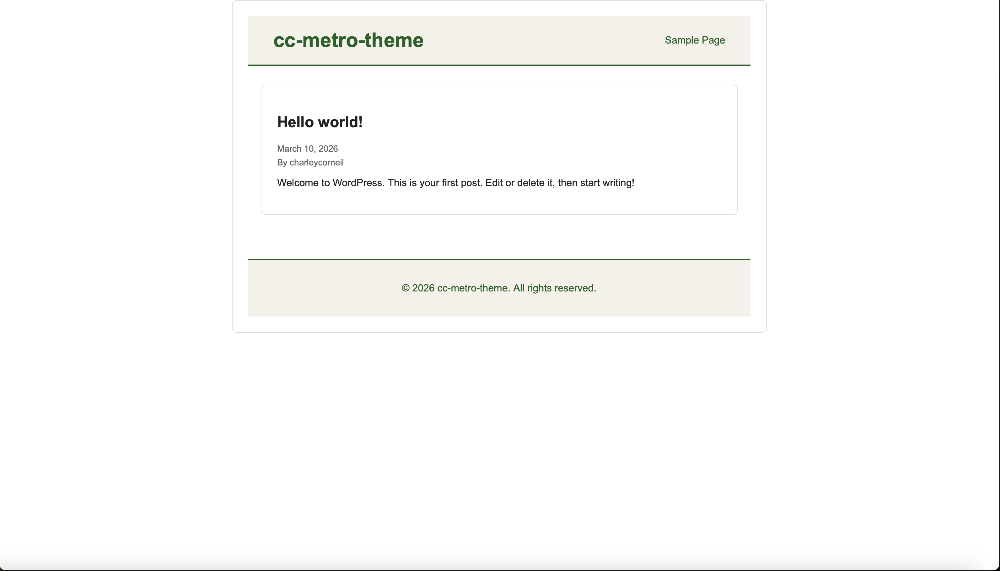
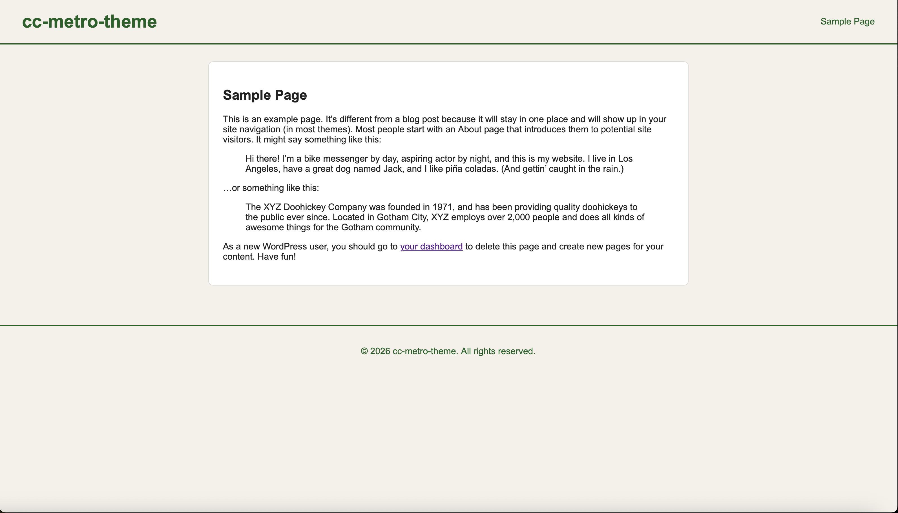

# Assignment 2: Custom WordPress Theme | Charley Corneil | 3/09/26

## WordPress Theme Structure

The CC Metro Theme was created for Assignment 2: Metro Theme. The theme is created to display news posts using WordPress template files and basic styling.

The theme includes the main files needed for a custom WordPress theme. These files work together to control the layout of the site and display posts and pages.

## The Loop & Template Tags

The WordPress **Loop** is used to display posts dynamically on the homepage and other templates. The theme uses template tags such as the_title(), the_permalink(), and the_content() to display different parts of post information like the title, image, date, and content.

## Theme Working Screenshots

### Post Template

### Page Template

### Sample Page

